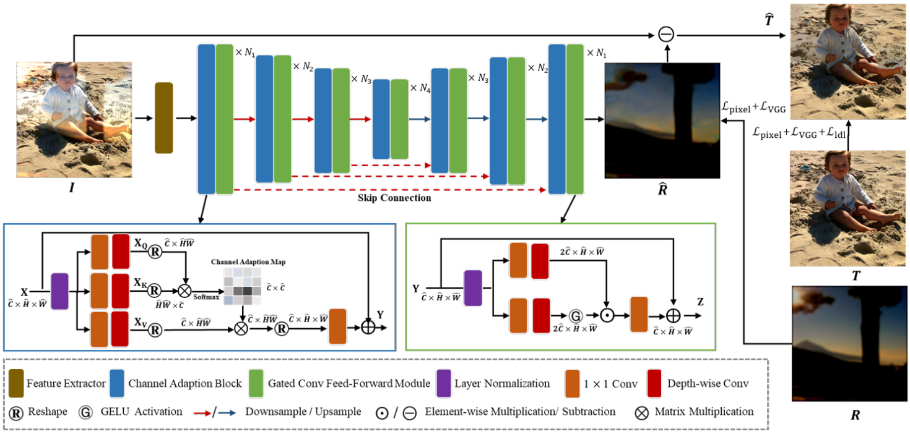
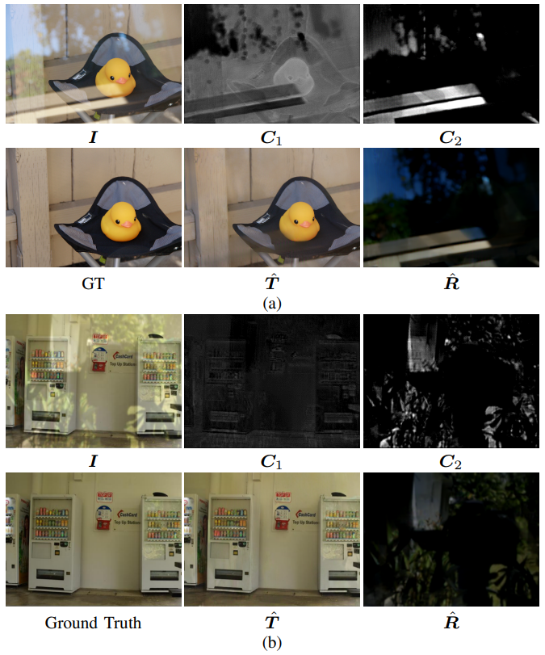

# Single Image Reflection Removal via Channel Adaption and Local Discrimination Loss
 This repository is the official implementation of the paper "Single Image Reflection Removal via Channel Adaption and Local Discrimination Loss".

# Requirement
- Python 3.9
- Pytorch 1.11
- CUDA 11.1
- OpenCV-Python
- 

## Introduction
In practical scenarios, reflections may impair the visual quality of images,
bring negative impacts to both human perception and subsequent computer vision tasks. 
Removing reflections from an image poses considerable challenges due to the diverse nature of reflection content, often blended with background targets. 
To address the issue, this paper proposes a single image reflection removal method, which is based on a channel adaption mechanism and a local discrimination loss. 
By exploiting the mutual relationship between feature maps with a self-attention mechanism, the channel adaption automatically re-weights each feature according to the input content, benefiting  the separation of reflections. 
For further improvement, a scaled variance map is generated from local statistics and then used in the local discrimination loss to ensure the consistency of the reflection removal effect within local regions. 
Experimental comparisons have demonstrated the effectiveness and superiority of the proposed method for single image reflection removal.




## Dataset
- synthetically blended data is created on-the-fly so there is only reflection layer and transmission layer folders
- real data has blended images and ground truth transmission layer (NO ground truth reflection layer)

### Try with your own dataset
You can also try with your own dataset. For example, to generate your own synthetic dataset, prepare for two folders of images, one used for transmission layer and the other used for reflection layer. 
In order to use our data loader, please follow the instructions below to organize your dataset directories. Overall, we name the directory of input image with reflection `blended`, 
the ground truth transmission layer `transmission_layer` and the ground truth reflection layer `reflection_layer`.

For synthetic data, since we generate images on the fly, there is no need to have the blended subdirectory.
```
| --syn
	| --transmission_layer
	| --reflection_layer
```
For real data, since the ground truth reflection layer is not available, there is no need to have the reflection_layer subdirectory.
```
| --real
    | --blended
    | --transmission_layer
```
## Training
To train the removal model:

please run `train.py`

## Testting
To test the removal model:
please download the pre-trained model [[here]](https://drive.google.com/file/d/1ycLkSDF-a-yt0iaIg1ZaoQ_vG92S0SX9/view?usp=share_link) and put in `checkpoint`, run `test.py`.

## Acknowledgments
Part of the code is based upon [[Restormer]](https://github.com/swz30/Restormer)


